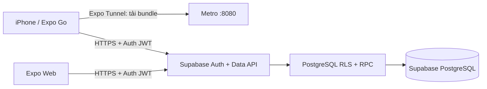

# 03. Kiến trúc hệ thống

## Tổng quan



Tunnel chỉ phục vụ quá trình tải JavaScript từ máy phát triển. Sau khi mở app, thiết bị gọi trực tiếp Supabase qua HTTPS. Không có API Node cục bộ trong đường đi dữ liệu nên mạng LAN/IP máy tính không ảnh hưởng tới thao tác của iPhone.

## Các thành phần

| Thành phần | Trách nhiệm |
|---|---|
| Supabase Auth | Đăng ký email/mật khẩu, phiên đăng nhập và UUID người dùng |
| Supabase Data API | Giao tiếp HTTPS trực tiếp từ Expo qua publishable key và JWT |
| PostgreSQL/RLS | Lưu hồ sơ, phòng, khung bận và lịch; giới hạn hàng theo `auth.uid()` |
| PostgreSQL RPC | Tạo/hủy/xóa lịch có kiểm tra nghiệp vụ và transaction |
| `src/services` | Ánh xạ dữ liệu DB, gọi RPC và truy vấn có RLS |
| TanStack Query | Cache server state, làm mới sau mutation |
| Zustand + AsyncStorage | Lưu bộ lọc giao diện trên thiết bị |
| `AuthProvider` | Khôi phục session, theo dõi đăng nhập/đăng xuất và bảo vệ màn hình |

## Schema

```mermaid
erDiagram
  AUTH_USERS ||--|| PROFILES : owns
  AUTH_USERS ||--o{ BOOKINGS : books
  ROOMS ||--o{ BOOKINGS : receives
  ROOMS ||--o{ BLOCKED_SLOTS : has
  AUTH_USERS { uuid id PK }
  PROFILES { uuid id PK, text full_name, timestamptz created_at, timestamptz updated_at }
  ROOMS { text id PK, text name, text building, integer capacity, jsonb amenities, boolean active }
  BLOCKED_SLOTS { bigint id PK, text room_id FK, date booking_date, integer start_hour, integer end_hour }
  BOOKINGS { text id PK, uuid user_id FK, text room_id FK, date booking_date, integer start_hour, integer end_hour, text status }
```

`auth.users` là danh tính chuẩn. Trigger tạo `profiles` khi đăng ký. `rooms` và `blocked_slots` chỉ đọc cho người đã đăng nhập; người dùng chỉ đọc profile/booking có cùng UUID. Thao tác booking ghi qua RPC `SECURITY DEFINER` với `search_path` cố định, không cấp trực tiếp quyền insert/update/delete cho app.

## Quy tắc giao dịch

`create_my_booking` lấy user từ JWT (`auth.uid()`), kiểm tra ngày trong 7 ngày tới, giờ hoạt động và thời lượng tối đa 3 giờ. RPC làm mới lịch bận, khóa transaction theo ngày/phòng bằng advisory lock, rồi kiểm tra lịch trường, xung đột phòng và xung đột cá nhân trước khi insert. Khoảng thời gian dùng `[start,end)`, nên slot kết thúc lúc 11:00 không xung đột slot bắt đầu lúc 11:00.

`cancel_my_booking` chỉ hủy lịch đã xác nhận thuộc người gọi, đặt `cancelled_at` và giữ lịch sử. `delete_my_cancelled_booking` chỉ xóa lịch đã hủy của chính người gọi. RLS che các hàng của người dùng khác khi truy vấn danh sách.

## Quyền sở hữu state

- PostgreSQL: dữ liệu dùng chung phòng, lịch bận; hồ sơ và booking theo tài khoản.
- Supabase Auth: session và UUID người dùng.
- TanStack Query: rooms, availability, bookings và phiếu; cache được xóa khi đổi tài khoản.
- Zustand: bộ lọc tìm phòng, không lưu booking.
- Component state: ngày chọn, thời lượng, modal xác nhận và input đang sửa.

## Kết nối iPhone

Metro dùng cổng 8080 để phát bundle và có thể dùng Expo Tunnel. Supabase Data API dùng HTTPS với host `<project-ref>.supabase.co`. Không cấu hình IP LAN, cổng backend riêng, quyền Local Network hoặc cho phép HTTP không an toàn trong iOS.

## Triển khai

Publishable key được coi là công khai và nằm trong bundle; quyền thật được kiểm soát bằng JWT, RLS và RPC. Không bao giờ đưa secret/service-role key vào Expo. Bản production cần cấu hình redirect/email SMTP phù hợp, backup database, giám sát lỗi và kiểm soát migration.
