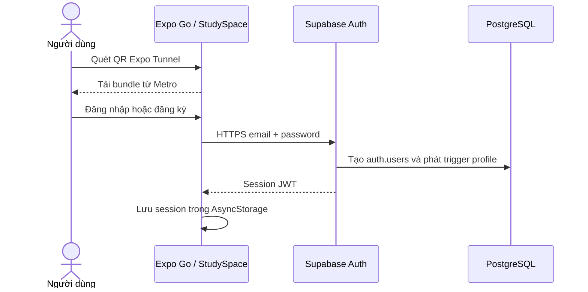
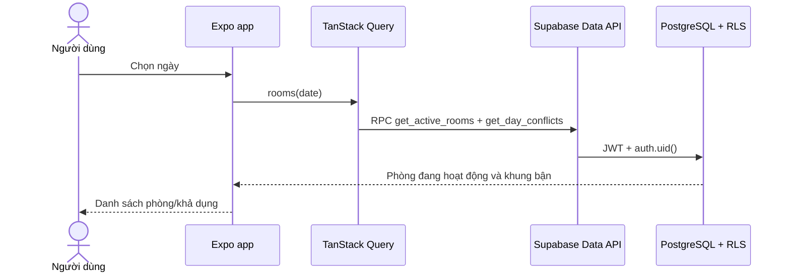
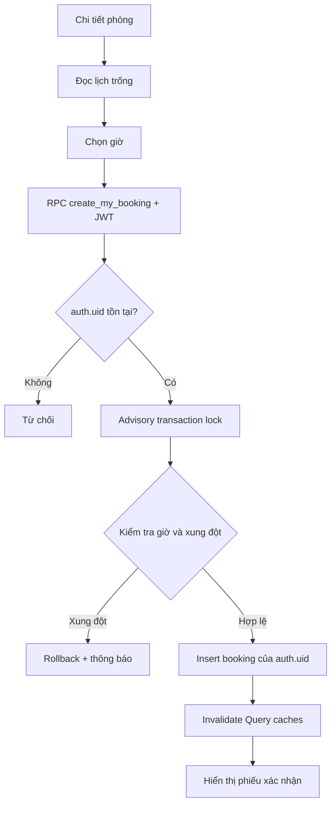

# 04. Workflow hoạt động

## Khởi động và xác thực

Khi mở lại app, `AuthProvider` khôi phục session đã lưu. Đăng xuất xóa session và cache server state; các màn hình dữ liệu chỉ xuất hiện khi có user session.

## Tải phòng và lịch trống

Tìm kiếm và filter chạy trên dữ liệu đã tải. Khi đổi ngày, query key thay đổi để lấy lịch mới. Thao tác kéo xuống refetch dữ liệu từ Supabase.

## Đặt lịch

Khung giờ bị vô hiệu hóa trong giao diện để người dùng dễ chọn. RPC vẫn kiểm tra lại trong transaction vì một thiết bị khác có thể đặt sau khi màn hình đã tải.

## Hủy và xóa lịch sử

Người dùng xác nhận hủy → RPC `cancel_my_booking` kiểm tra chủ sở hữu và trạng thái → cập nhật trạng thái, thời điểm hủy → invalidate danh sách/lịch trống. Dữ liệu còn trong lịch sử. Khi người dùng chọn xóa một lịch đã hủy, xác nhận lần nữa rồi gọi `delete_my_cancelled_booking`; database chỉ xóa đúng bản ghi thuộc tài khoản.

## Mất kết nối

Truy vấn Supabase trả lỗi rõ ràng và có thể thử lại khi mạng phục hồi. Cache có thể hiển thị dữ liệu đã tải trong khi truy vấn, nhưng thao tác ghi chỉ báo thành công khi RPC đã commit trên PostgreSQL. Expo Tunnel cấp bundle và có thể lỗi độc lập; nó không phải kết nối backend.

## Dữ liệu theo màn hình

| Màn hình | Query/thao tác |
|---|---|
| Đăng nhập | Supabase Auth sign-in/sign-up |
| Khám phá | Phòng và khung bận theo ngày |
| Chi tiết phòng | Phòng, availability, `create_my_booking` |
| Lịch đặt | Booking của `auth.uid()`, hủy, xóa lịch đã hủy |
| Phiếu | Booking theo ID; RLS chỉ trả về bản ghi của chủ sở hữu |
| Cá nhân | Profile, cập nhật tên, đăng xuất |
